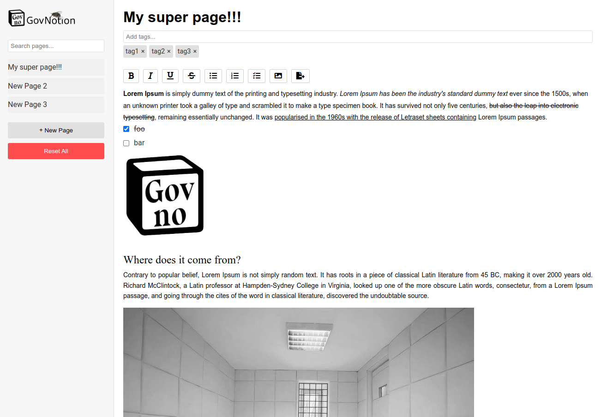

# GovNotion

**GovNotion** is a lightweight, browser-based web application inspired by the popular productivity tool, Notion. It provides a minimalist and intuitive interface for creating, managing, and organizing your notes, tasks, and ideas. Built with HTML, CSS, and JavaScript, GovNotion leverages modern web technologies to offer a seamless and interactive user experience directly in your web browser, making it an ideal tool for quick note-taking, project management, and task tracking.

## Features

- **Dynamic Page Management**: Create, edit, and delete pages effortlessly. Each page is automatically saved in the browser's local storage, ensuring your data is preserved between sessions.
- **To-do List Integration**: Add interactive to-do lists to your pages. Mark tasks as completed, or add new ones with ease, directly in the editor.
- **Markdown Editing**: Write and format text using markdown. The editor supports common markdown syntax for headings, lists, links, and more.
- **Command Palette**: Quickly access commands by typing `/` in the editor. Insert headings, lists, and other elements without leaving the keyboard.
- **Search Functionality**: Utilize the built-in search bar to quickly locate pages by title, content, or tags.
- **Undo/Redo**: Keep track of your changes with built-in undo/redo functionality, allowing you to easily revert or reapply edits.
- **Drag-and-Drop Page Reordering**: Organize your pages by simply dragging and dropping them within the page list.
- **Export to Markdown**: Export your pages as `.md` files for backup or further use in other markdown-supported applications.
- **Responsive Design**: The interface is fully responsive, adapting to different screen sizes, making it accessible on both desktop and mobile devices.

## Getting Started

### Prerequisites

To run GovNotion locally, you only need a modern web browser (e.g., Chrome, Firefox, Safari).

### Installation

1. **Clone the Repository**:
    ```bash
    git clone https://github.com/gitkv/govnotion.git
    ```

2. **Navigate to the Project Directory**:
    ```bash
    cd govnotion
    ```

3. **Open `index.html` in Your Browser**:
   Simply double-click `index.html` to open the application in your default web browser. Alternatively, you can serve the project using a local server for a more integrated experience.

### Usage

- **Creating Pages**: Click on the "+ New Page" button to create a new page. Enter a title and start typing your content.
- **Organizing Content**: Use the toolbar to format your text, create lists, and manage tasks. Drag and drop pages in the sidebar to reorder them.
- **Searching for Pages**: Use the search bar at the top of the sidebar to find pages by title, content, or tags.
- **Exporting Pages**: Click the "Export" button to download the current page as a markdown file.

### Deployment on GitHub Pages

Deploying GovNotion on GitHub Pages is straightforward:

1. **Push Your Code**: Ensure your code is pushed to the `master` branch of your repository.
2. **Configure GitHub Pages**:
   - Navigate to the repository settings.
   - Scroll down to the "Pages" section.
   - Under "Source," select the branch `master` and the root directory.
   - Save the settings.
3. **Access Your App**: Your application will be live at `https://yourusername.github.io/govnotion`.

## Screenshots

### Desktop View



### Mobile View


## Development

### Code Structure

- **HTML (`index.html`)**: The main structure of the application, containing all elements and components.
- **CSS (`styles.css`)**: Custom styles for the application, ensuring a clean and responsive design.
- **JavaScript (`script.js`)**: Core functionality, including page creation, markdown rendering, and local storage management.
- **Assets**: Favicon and icon files for different devices, ensuring a polished user experience across platforms.

### Customization

GovNotion is designed to be easily customizable. You can modify the styles, add new features, or integrate it with other tools by editing the provided CSS and JavaScript files.

## Contributing

We welcome contributions! If you'd like to contribute to GovNotion, please follow these steps:

1. **Fork the Repository**: Click on the "Fork" button at the top of the repository page.
2. **Create a New Branch**: Create a new branch for your feature or bugfix.
    ```bash
    git checkout -b my-new-feature
    ```
3. **Commit Your Changes**: Make your changes and commit them.
    ```bash
    git commit -am 'Add new feature'
    ```
4. **Push to the Branch**: Push your changes to your branch.
    ```bash
    git push origin my-new-feature
    ```
5. **Submit a Pull Request**: Open a pull request from your branch to the `master` branch of the original repository.

## License

GovNotion is licensed under the [MIT License](LICENSE). You are free to use, modify, and distribute this software as you see fit, provided that you include a copy of the license in any substantial portions of the software.

## Acknowledgements

- **FontAwesome**: For providing a rich set of icons.
- **SortableJS**: For the drag-and-drop functionality.
- **Marked.js & Turndown.js**: For enabling markdown support and conversion.

## Contact

If you have any questions, suggestions, or issues, please feel free to open an issue on GitHub or contact the repository owner directly.
